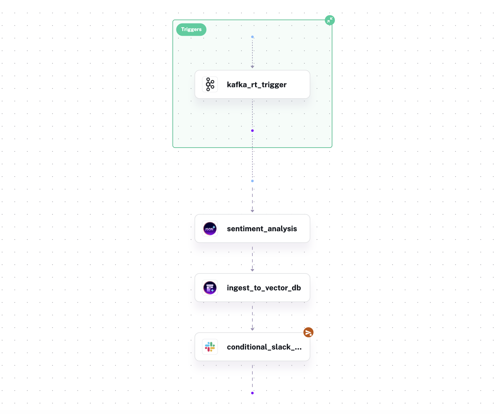

# Real-Time Sentiment Analysis with Kestra

A step-by-step tutorial for building a real-time customer review pipeline that performs AI-powered sentiment analysis, stores enriched vector embeddings in MongoDB, and fires targeted Slack alerts for high-priority negative feedback.

## What you'll build

Each incoming customer review triggers a Kestra execution that:

1. Calls an OpenAI LLM to extract sentiment, a confidence score, and key topics from the review text
2. Generates a vector embedding of the review text and writes it to MongoDB along with all metadata making reviews searchable by semantic similarity
3. Sends an immediate Slack alert when the sentiment is **negative** *and* the review author is a **premium** customer.



You'll build this in four incremental steps, each adding one layer of functionality, finishing with a fully event-driven pipeline that processes reviews in real time as they get consumed from a Kafka topic by Kestra's real-time trigger capabilities.

## 1. Prerequisites

| Requirement | Notes |
|---|---|
| **Docker Desktop** (or Docker Engine + Compose plugin) | v4.x or later recommended |
| **OpenAI API key** | Must have access to `gpt-4o-mini` (chat completions) and `text-embedding-3-small` (embeddings) |
| **Slack incoming webhook URL** | Create one by following [Slack's incoming webhooks guide](https://api.slack.com/messaging/webhooks) — you need a Slack workspace and permission to add an app |

## 2. Configure Your Secrets

Kestra OSS reads secrets from environment variables whose names are by convention prefixed with `SECRET_`. The values must be **Base64-encoded**.

### Encode your credentials

**macOS / Linux:**

```bash
echo -n "sk-your-openai-api-key" | base64
echo -n "https://hooks.slack.com/services/T.../B.../..." | base64
```

**Windows (PowerShell):**

```powershell
[Convert]::ToBase64String([Text.Encoding]::UTF8.GetBytes("sk-your-openai-api-key"))
[Convert]::ToBase64String([Text.Encoding]::UTF8.GetBytes("https://hooks.slack.com/services/T.../B.../..."))
```

### Edit `compose.yaml`

Open `compose.yaml` in a text editor and find the `environment` block of the `kestra` service. Uncomment and fill in the two secret lines:

```yaml
# Before (commented out):
#SECRET_OPENAI_API_KEY: "<ADD_YOUR_BASE64_ENCODED_OPENAI_API_KEY_HERE>"
#SECRET_SLACK_WEBHOOK_URL: "<ADD_YOUR_BASE64_ENCODED_WEBHOOK_URL_HERE>"

# After (replace the placeholder strings with your actual Base64 values):
SECRET_OPENAI_API_KEY: "c2steW91ci1rZXktaGVyZQ=="
SECRET_SLACK_WEBHOOK_URL: "aHR0cHM6Ly9ob29rcy5zbGFjay5jb20v..."
```

Note: The MongoDB password (`SECRET_MONGODB_PASSWORD`) is already set. It corresponds to the `root` password defined in the `mongodb` service, so you don't need to touch it.

## 3. Start the Docker Compose Stack

Go into the `01_sentiment_analysis` directory, and start all services:

```bash
docker compose up -d
```

This brings up four containers:

| Service | Purpose | Exposed port |
|---|---|---|
| `postgres` | Kestra's internal database which stores flow definitions, execution state, and logs | — |
| `kestra` | The orchestration engine and web UI | 8080 (UI), 8081 (API) |
| `kafka` | The event streaming platform to publish customer reviews | 9092 (internal), 29092 (host) |
| `mongodb` | MongoDB Atlas Local to store embedded reviews with a vector search index | 27017 |

A fifth ephemeral service, `mongodb-init`, runs once on startup to create the `reviews_db.customer_reviews` collection and its cosine vector search index (1536 dimensions, matching `text-embedding-3-small`), then exits cleanly.

Verify everything is up:

```bash
docker compose ps
```

### Open Kestra

Navigate to **http://localhost:8080** and log in:

- **Username:** `admin@kestra.io`
- **Password:** `Admin1234!`

## 4. Brief Kestra Orientation

_NOTE: Skip directly to the next section below if you are already familiar with basic Kestra concepts._

Before writing any flows, here are the six concepts you'll encounter throughout this tutorial.

**Flow**
The core unit of work in Kestra. A flow is a YAML document that defines what to do (tasks), how it's triggered (triggers or manual execution), and what parameters it accepts (inputs). Think of it as a self-contained, versioned workflow.

**Namespace**
A hierarchical grouper for flows, similar to a project folder. The flow in this tutorial lives under `demo.use_cases`.

**Task**
A single step inside a flow. Kestra ships with hundreds of built-in tasks for HTTP calls, database queries, AI operations, file processing, notifications, and more. Each task is identified by a fully-qualified `type` string, for example `io.kestra.plugin.ai.completion.JSONStructuredExtraction` which will be used in this tutorial.

**Trigger**
What starts a flow execution. A trigger can be manual (you click Execute in the UI), scheduled (a cron expression), or event-driven (a new Kafka message, a new file in S3, a webhook call, etc.). In steps 1–3 of this tutorial you'll trigger flows manually; in step 4 you'll switch to a Kafka real-time  trigger.

**Secret**
A sensitive value stored outside the flow YAML and injected at runtime. You reference secrets in flows with `{{ secret('KEY_NAME') }}`. In this stack they're supplied as Base64-encoded environment variables on the `kestra` container.

**Execution**
A single run of a flow. The Kestra UI shows real-time logs, task states, outputs, and the Gantt chart of task timings for every execution.

## Step 1: Sentiment extraction

### What this step adds

A new Kestra flow that accepts a customer review as a JSON input, logs the review text, and calls OpenAI to extract three structured fields:

- `sentiment`: one of `Positive`, `Neutral`, or `Negative`
- `confidence`: a float between 0.0 and 1.0
- `key_topics`: an array of up to five topics mentioned in the review

### Create the flow

1. In the Kestra UI, click **Flows** in the left sidebar.
2. Click the **+** button (top-right corner) to open the flow editor.
3. Replace all content in the editor with the YAML below.
4. Click **Save**.

```yaml
id: reviews_sentiment
namespace: demo.use_cases

inputs:
  - id: record
    type: JSON
    defaults: |
      {"review_id":"REV-001","customer_id":"CUST-1042","customer_tier":"Standard","product_id":"PROD-NOVA-BT500","review_text":"I've been a casual audio enthusiast for years and have tried dozens of headphones in the mid-range bracket, but the NovaSound BT500 has genuinely surprised me. The moment I slipped them on I noticed how light they feel despite the solid build quality — the ear cups are generously padded and don't cause fatigue even after three or four hours of continuous use. Pairing was effortless; my phone found the headphones instantly and reconnected automatically every time afterward without a single dropout. Sound quality is where these really shine. The bass is punchy without being overblown, mids are clear enough for podcasts and audiobooks, and the highs have a brightness that doesn't tip into harshness. Battery life has been exceptional — I'm getting close to 28 hours per charge, which means I rarely need to think about plugging them in. The active noise cancellation isn't class-leading, but it handles open-plan office noise and commute rumble very comfortably. My only minor gripe is that the companion app feels a bit dated and the EQ options are limited. That said, for the price, the NovaSound BT500 punches well above its weight. I'd recommend these without hesitation to anyone looking for reliable everyday headphones.","timestamp":"2026-04-03T08:14:22Z"}

tasks:
  - id: log
    type: io.kestra.plugin.core.log.Log
    message: "{{ inputs.record.review_text }}"

  - id: sentiment_analysis
    type: io.kestra.plugin.ai.completion.JSONStructuredExtraction
    provider:
      type: io.kestra.plugin.ai.provider.OpenAI
      apiKey: "{{ secret('OPENAI_API_KEY') }}"
      modelName: "gpt-4o-mini"
    schemaName: llmOutputSchema
    jsonFields:
      - sentiment
      - confidence
      - key_topics
    prompt: |
      Analyse the following customer review and extract:

      - sentiment: a JSON string mapping to exactly one of Positive, Neutral, Negative
      - confidence: a JSON number between 0.0 and 1.0 representing your certainty about the sentiment
      - key_topics: a JSON string array of up to 5 key topics mentioned in the review

      Example for a valid JSON result object:

      {
        "sentiment": "Positive",
        "confidence": 0.95,
        "key_topics": [
          "headphones",
          "sound quality",
          "battery life",
          "active noise cancellation",
          "comfort"
        ]
      }

      Review to analyze: {{ inputs.record.review_text }}
```

### What's happening

* **`id` and `namespace`**

`reviews_sentiment` is the unique identifier for this flow within the `demo.use_cases` namespace. Because all four versions of this flow share the same `id` and `namespace`, each version you save will overwrite the previous one in place. This is intentional and lets you iterate without managing multiple separate flows.

* **`inputs`**

Inputs define the parameters a caller must (or may) supply when triggering the flow. The single `record` input is typed as `JSON`, so Kestra automatically parses the raw JSON string into an object, making its fields accessible via dot notation. The `defaults` value pre-fills the input with a sample review. This means you can click Execute and run the flow immediately.

* **`log` task**

The simplest possible task: it writes a message to the execution log. `{{ inputs.record.review_text }}` is Kestra's [Pebble](https://pebbletemplates.io/) template syntax — it reads the `review_text` field from the parsed `record` input at runtime.

* **`sentiment_analysis` task**

`JSONStructuredExtraction` is a Kestra AI plugin task that sends a prompt to an LLM and instructs it to return a specific JSON structure. Key fields:

- `provider`: identifies the LLM backend. Here we use OpenAI's `gpt-4o-mini`. The API key is read from the `OPENAI_API_KEY` secret at runtime.
- `schemaName`: a label for the output schema used internally by the plugin.
- `jsonFields`: the exact field names the LLM must include in its JSON response.
- `prompt`: the instruction sent to the model. `{{ inputs.record.review_text }}` injects the actual review text at runtime.

The structured JSON response from the LLM is available to all subsequent tasks as `{{ outputs.sentiment_analysis.extractedJson }}`.

### Run it

1. With the flow open, click **Execute**.
2. The input form shows the `record` field pre-filled with the default review JSON. Click **Execute** to proceed with it.
3. Watch both tasks complete in the **Gantt** or **Logs** tab.
4. Click the `sentiment_analysis` task row and open its **Outputs** panel. You'll see `extractedJson` containing the structured result from the LLM.

> The complete flow definition for this step is in [`flows/reviews_sentiment_v1.yaml`](flows/reviews_sentiment_v1.yaml).

---

## Step 2: Vector Embedding and Storage

### What this step adds

A new task that takes the review text, generates a 1536-dimensional vector embedding using OpenAI's `text-embedding-3-small` model, and writes the vector together with all extracted metadata to the MongoDB `customer_reviews` collection. This makes every review semantically searchable. This could be a foundation for an AI-powered search and support bot that can find relevant past reviews by meaning rather than keywords.

### Add the task

Open the flow in the Kestra UI (Flows → `reviews_sentiment` → **Edit** or the **Source** tab). Append the following task block at the end of the `tasks` list, then click **Save**.

```yaml
  - id: ingest_to_vector_db
    type: io.kestra.plugin.ai.rag.IngestDocument
    provider:
      type: io.kestra.plugin.ai.provider.OpenAI
      apiKey: "{{ secret('OPENAI_API_KEY') }}"
      modelName: text-embedding-3-small
    embeddings:
      type: io.kestra.plugin.ai.embeddings.MongoDBAtlas
      host: mongodb
      scheme: mongodb
      username: root
      password: "{{ secret('MONGODB_PASSWORD') }}"
      database: reviews_db
      collectionName: customer_reviews
      indexName: vector_index
      options:
        authSource: admin
      metadataFieldNames:
        - review_id
        - customer_id
        - customer_tier
        - product_id
        - timestamp
        - sentiment
        - confidence
        - key_topics
    fromDocuments:
      - content: "{{ inputs.record.review_text }}"
        metadata:
          review_id: "{{ inputs.record.review_id }}"
          customer_id: "{{ inputs.record.customer_id }}"
          customer_tier: "{{ inputs.record.customer_tier }}"
          product_id: "{{ inputs.record.product_id }}"
          timestamp: "{{ inputs.record.timestamp }}"
          sentiment: "{{ json(outputs.sentiment_analysis.extractedJson).sentiment }}"
          confidence: "{{ json(outputs.sentiment_analysis.extractedJson).confidence }}"
          key_topics: "{{ json(outputs.sentiment_analysis.extractedJson).key_topics }}"
```

### What's happening

* **`IngestDocument` task**

    This task handles the full embedding pipeline in a single step: it calls the embedding model, receives the vector, and writes both the vector and the associated metadata to the configured vector store. You don't need to manage the API call, the serialization, or the MongoDB write separately.

* **`provider` block**

    Same OpenAI provider as before, but the `modelName` is now `text-embedding-3-small`. This  embedding model converts a the review text into a 1536-dimensional floating-point vector. This dimension count must match the `numDimensions` value configured for the `vector_index` in MongoDB when the database was initialised.

* **`embeddings` block**

    Points the task at MongoDB Atlas Local running in the `mongodb` container. `indexName: vector_index` matches the vector search index created by `mongodb-init` at startup. The `metadataFieldNames` list tells the plugin which scalar fields to store alongside the vector in MongoDB, enabling filtered vector searches. For example, "find the 10 reviews most semantically similar to this complaint, but only from Premium customers."

* **`fromDocuments`** block:

    The list of documents to embed, here we only have one per execution. Each entry has:

    - `content`: the raw text to embed (the review text)
    - `metadata`: scalar values stored alongside the vector. Notice that `sentiment`, `confidence`, and `key_topics` are pulled from the previous task's output using `{{ json(outputs.sentiment_analysis.extractedJson).<fieldName> }}`. This is how Kestra tasks chain together. The structured JSON output of the previous task becomes the input expression for the current task.

> The complete flow definition for this step is in [`flows/reviews_sentiment_v2.yaml`](flows/reviews_sentiment_v2.yaml).

### Run it

Click **Execute** using the default input to verify all three tasks complete.

## Step 3: Conditional Slack Alerts

### What this step adds

A new task that sends a Slack notification but only when two conditions are simultaneously met: **the LLM classified the review as `Negative` *and* the customer's tier is `Premium`**. Other combinations for these conditions will skip the task silently. This implements a "high-priority" escalation: not every negative review needs immediate attention, but a Premium customer having a bad experience does.

### Add the task

Open the flow editor and append this task block at the end of the `tasks` list, then click **Save**.

```yaml
  - id: conditional_slack_alert
    type: io.kestra.plugin.slack.notifications.SlackIncomingWebhook
    runIf: "{{ json(outputs.sentiment_analysis.extractedJson).sentiment == 'Negative' and inputs.record.customer_tier == 'Premium' }}"
    url: "{{ secret('SLACK_WEBHOOK_URL') }}"
    payload: |
        {
          "blocks": [
            {
              "type": "header",
              "text": { "type": "plain_text", "text": ":rotating_light: Negative Review — Premium Customer" }
            },
            {
              "type": "section",
              "fields": [
                { "type": "mrkdwn", "text": "*Review ID:*\n{{ inputs.record.review_id }}" },
                { "type": "mrkdwn", "text": "*Customer:*\n{{ inputs.record.customer_id }}" },
                { "type": "mrkdwn", "text": "*Product:*\n{{ inputs.record.product_id }}" }
              ]
            }
          ]
        }
```

### What's happening

* **`runIf`**

    A Pebble expression evaluated at runtime before the task executes. If it resolves to `false`, Kestra marks the task as `SKIPPED` and the execution continues normally. This is one of the idiomatic Kestra pattern for conditional execution: conditions are expressed inline on individual tasks. In this case there is no neeed for explicit control-flow blocks.

    The expression here combines two predicates with `and`:
    
    - `json(outputs.sentiment_analysis.extractedJson).sentiment == 'Negative'`: reads the LLM's classification from the previous task's output
    - `inputs.record.customer_tier == 'Premium'`: reads the tier field from the original input record

* **`SlackIncomingWebhook` task**

    Posts a [Block Kit](https://api.slack.com/block-kit) message to the webhook URL stored in the `SLACK_WEBHOOK_URL` secret. The `payload` is a JSON string evaluated as a Pebble template. All `{{ ... }}` expressions are resolved at runtime before the HTTP request is sent to Slack.

### Try it out

Run the flow with the default input (`REV-001`: Standard tier, Positive review). The Slack task will be marked `SKIPPED`. If you execute the flow again by pasting in `REV-002` from `data/reviews.jsonl` as the input value, it's a `Premium` customer with a strongly negative experience. This time the Slack task should fire and you should see the alert arrive in your Slack channel.

> The complete flow definition for this step is in [`flows/reviews_sentiment_v3.yaml`](flows/reviews_sentiment_v3.yaml).

## Step 4: Real-time Kafka Trigger

### What this step adds

The flow so far requires a human to click Execute and supply a review. In this final step you'll replace that manual input mechanism with a `RealtimeTrigger` that consumes from the `customer-reviews` Kafka topic. Every message published to that topic automatically triggers a new Kestra flow execution.

### Replace the trigger

Open the flow editor. **Remove the entire `inputs:` block** at the top of the flow. In its place, add a `triggers:` block like so:

```yaml
triggers:
  - id: kafka_rt_trigger
    type: io.kestra.plugin.kafka.RealtimeTrigger
    topic: customer-reviews
    valueDeserializer: JSON
    groupId: sentiment-consumer
    properties:
      bootstrap.servers: kafka:9092
```

### ! Important ! Switch to `trigger.value`

With the original `inputs` block gone, every reference to `inputs.record.*` in your task bodies must become `trigger.value.*`. The field names are identical, only the prefix changes. You can use the find/replace feature directly in the Kestra's UI Flow Editor to do this.

Click **Save**.

### What's happening

* **`RealtimeTrigger`**
    
    Unlike a scheduled trigger that polls on an interval, `RealtimeTrigger` maintains a live consumer connection to Kafka. The moment a message lands on `customer-reviews`, Kestra creates a new execution immediately. The parsed message payload is available inside the flow as `trigger.value`.

    - `topic`: the Kafka topic to consume from
    - `valueDeserializer: JSON`: Kestra deserializes each message's bytes as JSON, making all review fields directly accessible on `trigger.value`
    - `groupId`: the Kafka consumer group ID; this is used to track committed offsets so messages aren't reprocessed on restart
    - `bootstrap.servers: kafka:9092`: the Kafka broker address on the internal Docker network

### Stream the sample reviews

As soon as you save the flow, Kestra starts listening on the `customer-reviews` topic. Run the bundled producer script inside the Kafka container to stream all 50 sample reviews, one every two seconds:

```bash
docker exec -it kafka bash /home/stream_reviews.sh
```

Open the Kestra UI → **Executions** and watch new executions appear in real time. Each one is an independent execution of the full pipeline: the review is logged, analysed by the LLM, embedded and stored in MongoDB, and a Slack alter conditionally triggered for the reviews that are both negative and from a premium customer.

### Complete flow reference

For reference, the full flow with all tasks and the Kafka trigger in place is in [`flows/reviews_sentiment_v4.yaml`](flows/reviews_sentiment_v4.yaml). The complete YAML is reproduced here:

```yaml
id: reviews_sentiment
namespace: demo.use_cases

triggers:
  - id: kafka_rt_trigger
    type: io.kestra.plugin.kafka.RealtimeTrigger
    topic: customer-reviews
    valueDeserializer: JSON
    groupId: sentiment-consumer
    properties:
      bootstrap.servers: kafka:9092

tasks:
  - id: log
    type: io.kestra.plugin.core.log.Log
    message: "{{ trigger.value.review_text }}"

  - id: sentiment_analysis
    type: io.kestra.plugin.ai.completion.JSONStructuredExtraction
    provider:
      type: io.kestra.plugin.ai.provider.OpenAI
      apiKey: "{{ secret('OPENAI_API_KEY') }}"
      modelName: "gpt-4o-mini"
    schemaName: llmOutputSchema
    jsonFields:
      - sentiment
      - confidence
      - key_topics
    prompt: |
      Analyse the following customer review and extract:

      - sentiment: a JSON string mapping to exactly one of Positive, Neutral, Negative
      - confidence: a JSON number between 0.0 and 1.0 representing your certainty about the sentiment
      - key_topics: a JSON string array of up to 5 key topics mentioned in the review

      Example for a valid JSON result object:

      {
        "sentiment": "Positive",
        "confidence": 0.95,
        "key_topics": [
          "headphones",
          "sound quality",
          "battery life",
          "active noise cancellation",
          "comfort"
        ]
      }

      Review to analyze: {{ trigger.value.review_text }}

  - id: ingest_to_vector_db
    type: io.kestra.plugin.ai.rag.IngestDocument
    provider:
      type: io.kestra.plugin.ai.provider.OpenAI
      apiKey: "{{ secret('OPENAI_API_KEY') }}"
      modelName: text-embedding-3-small
    embeddings:
      type: io.kestra.plugin.ai.embeddings.MongoDBAtlas
      host: mongodb
      scheme: mongodb
      username: root
      password: "{{ secret('MONGODB_PASSWORD') }}"
      database: reviews_db
      collectionName: customer_reviews
      indexName: vector_index
      options:
        authSource: admin
      metadataFieldNames:
        - review_id
        - customer_id
        - customer_tier
        - product_id
        - timestamp
        - sentiment
        - confidence
        - key_topics
    fromDocuments:
      - content: "{{ trigger.value.review_text }}"
        metadata:
          review_id: "{{ trigger.value.review_id }}"
          customer_id: "{{ trigger.value.customer_id }}"
          customer_tier: "{{ trigger.value.customer_tier }}"
          product_id: "{{ trigger.value.product_id }}"
          timestamp: "{{ trigger.value.timestamp }}"
          sentiment: "{{ json(outputs.sentiment_analysis.extractedJson).sentiment }}"
          confidence: "{{ json(outputs.sentiment_analysis.extractedJson).confidence }}"
          key_topics: "{{ json(outputs.sentiment_analysis.extractedJson).key_topics }}"

  - id: conditional_slack_alert
    type: io.kestra.plugin.slack.notifications.SlackIncomingWebhook
    runIf: "{{ json(outputs.sentiment_analysis.extractedJson).sentiment == 'Negative' and trigger.value.customer_tier == 'Premium' }}"
    url: "{{ secret('SLACK_WEBHOOK_URL') }}"
    payload: |
        {
          "blocks": [
            {
              "type": "header",
              "text": { "type": "plain_text", "text": ":rotating_light: Negative Review — Premium Customer" }
            },
            {
              "type": "section",
              "fields": [
                { "type": "mrkdwn", "text": "*Review ID:*\n{{ trigger.value.review_id }}" },
                { "type": "mrkdwn", "text": "*Customer:*\n{{ trigger.value.customer_id }}" },
                { "type": "mrkdwn", "text": "*Product:*\n{{ trigger.value.product_id }}" }
              ]
            }
          ]
        }
```

---

## Teardown

To stop all services and remove containers:

```bash
docker compose down
```

To also remove the named volumes (Postgres state, Kestra storage) and start completely fresh next time:

```bash
docker compose down -v
```
